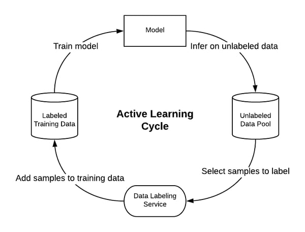
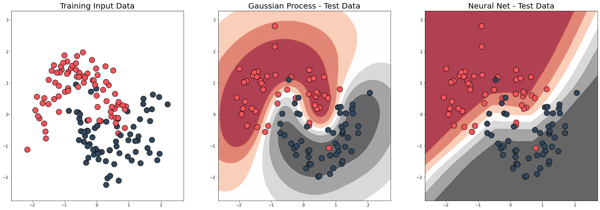
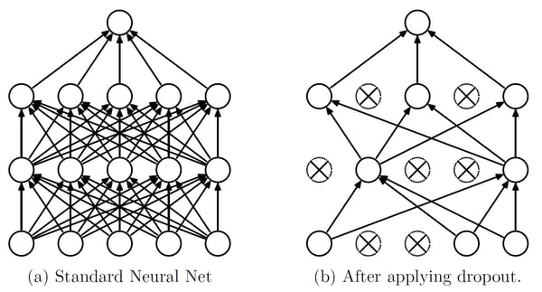
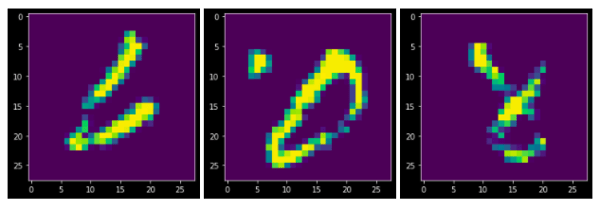
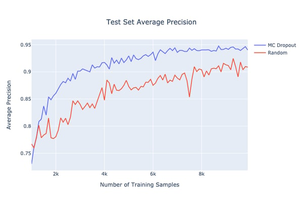

*Originally published on the [HubSpot Product & Engineering Blog](https://product.hubspot.com/blog/bayesian-active-learning).*

In order to reduce our data labeling needs, the AI Product Group at HubSpot is implementing an Active Learning based approach to choose samples from an unlabeled dataset that provide the most value. More specifically, since the majority of our models are based on deep neural networks, we incorporated recent advances in Bayesian deep learning regarding extracting reliable uncertainty estimates from neural networks into our Active Learning framework.

## Some Context

The majority of the machine learning models we build at HubSpot fall under the category of supervised learning, and getting ground truth labels is not always easy. In the context of a model being used within our product, we can either have the data hand-labeled by humans or collect the labels via a feedback mechanism within the product. The latter requires some foresight and isn't always possible. For example, consider the use case where a model is used to detect suspicious email lists and prevent users from sending emails to addresses found on said lists. In order to collect ground truth labels via a feedback mechanism we would need to ignore the model's suggestion and send emails to the suspicious email addresses to determine if they result in bounced emails.

OK, so let's just have our data hand labeled by human experts. There are a plethora of companies that offer data labeling services. We can have our pick, upload our data, sit back, and watch the labels come in, right? While we can do this, it can quickly get expensive. Additionally, when dealing with a lot of unlabeled data, the question arises of how to choose which samples to get labeled.

Consider a vehicle detection task of training a model to determine if an image contains a motorcyclist, cyclist, or neither. We might have hundreds of millions of unlabeled images. Most images will be nearly identical in their scenario in the sense that it will be fairly easy to tell if they contain motorcyclists, cyclists, or neither. However, there will be a long tail distribution of non-trivial corner-cases. For example, an image might contain a person riding an electric scooter from one of the popular scooter riding services. Is this person considered a cyclist, motorcyclist, or neither?

Generally speaking, a machine learning model will be able to learn the patterns found in the common scenario relatively quickly and will eventually face the law of diminishing returns. So how do we choose which samples to label? Here are some options.

- Label all of them → This can get very expensive. You'll have many redundant samples.

- Label a randomly sampled subset →  You'll still have many redundant samples.

- Be smart about how we select which samples to get labeled and choose them in such a way that gets us the most for our spend.

We are going to go with option three, as it's where the concept of Active Learning comes into play.

## Active Learning

What if our model could tell us which samples to label? This is precisely what the method of Active Learning is used to do. Using Active Learning, the model is able to proactively select a subset of samples to be labeled next from a pool of unlabeled samples. By doing so, the model can potentially achieve better performance with fewer labeled samples.

The Active Learning Cycle consists of four major steps. We need to start somewhere, so we select a small sample from our unlabeled pool data and get it labeled.

- Train a model on the labeled training dataset.

- Use the trained model to select samples from the unlabeled data pool.

- Send the selected samples to be labeled by human experts.

- Add the labeled samples to the training dataset and repeat the steps.

By following the Active Learning Cycle, the model is able to incrementally build up a training dataset that allows it achieve better performance on an out-of-sample test dataset. More importantly, it does so with fewer training samples when compared to a model that just randomly selects a subset of samples to be labeled.

## Picking Samples to Label

Let's talk more about step two. Once we have a trained model, we need to use it to somehow select which samples from our unlabeled pool dataset to get labeled. Consider again the vehicle detection task and imagine for a moment that you are the model and you need to pick which samples to get labeled. Logically, you wouldn't pick samples that you are absolutely sure about. Rather, you would pick samples that look like they might contain a bicyclist or a motorcyclist, but you are uncertain about your judgment. The interesting bit is figuring out exactly how to measure uncertainty.

## Measuring Uncertainty

One simple way to measure uncertainty is to just look at the output of the model. In our multiclass vehicle detection problem the output of the model is the result of a softmax function applied to the outputs of the last layer of the neural network. The resulting vector contains three probabilities, one for each class, that sum up to one. Using this output, we could use a couple of [popular selection methods](https://www.cs.cmu.edu/~tom/10701_sp11/recitations/Recitation_13.pdf) such as Least Confidence Selection, Margin Sample, or Entropy Sampling. However, we need to step back and ask ourselves: is using the softmax output actually a good measure of uncertainty?

The simple answer is no. Just because the model performs well for the prediction task, it does not mean that the estimated probabilities from the softmax function are well-calibrated. A one-third split across the three classes in our vehicle detection task could be derived from a very sharp distribution around those values, or from a uniform distribution across the 0 - 1 interval. The former indicates a confident model and the latter an unconfident one. Even with a high softmax output probability the model can be uncertain about its prediction.

OK, so we can't rely on the softmax output of the model as a good estimate of uncertainty. No worries, as there is a particular type of model that, in principle, knows what it doesn't know.

## Gaussian Processes

In a machine learning problem where the input and output are denoted by **x** and y respectively, the goal is to learn a function g(**x**) = y' that best approximates the target function f(x) = y. In order to do so, the learning algorithm seeks to optimize a cost function that measures the difference between the model's predictions y' and the ground truth labels y.

A Gaussian Process model uses a non-parametric approach that finds a distribution over all possible functions approximating the target function f(x) that are consistent with the observed data.

The charts above show the decision boundaries of a Gaussian Process versus a Network model. If we use the predictions from the model as a measure of uncertainty, then the decision boundaries can be interpreted as an uncertainty heatmap. Notice how the Gaussian Process model is less certain about its predictions on data points that are farther away from the training data points.

So that's it right? Let's just use a Gaussian Process model. Problem solved. Unfortunately, it's not that easy. Gaussian Processes models are non-parametric, which causes them to require the entire training dataset each time to make a prediction. Furthermore, they lose efficiency in high dimensional spaces where the input to the model consists of many features. As a result, using a Gaussian Process model is too computationally exhaustive and not well supported for a production setting.

So we can't directly use a Gaussian Process model. What if there was a way to approximate one?

## Bayesian Deep Learning

In their paper [Dropout as a Bayesian Approximation: Representing Model Uncertainty in Deep Learning](https://arxiv.org/pdf/1506.02142.pdf), Garin et al. show that a "multilayer perceptron with arbitrary depth and non-linearities and with dropout applied after every weight layer is mathematically equivalent to an approximation to the deep Gaussian process".

Let's break that down starting with the concept of dropout. When training neural networks, it is common practice to use different regularization techniques to reduce overfitting, which occurs when the model learns to simply memorize the training data. As a result, its performance on training data is significantly better than the performance on test data. Dropout is one such regularization technique used to reduce overfitting in neural networks. It works by randomly turning off some of the nodes in the network during each training iteration.

*[Source](https://jmlr.org/papers/volume15/srivastava14a/srivastava14a.pdf): Srivastava, Hinton, Krizhevsky, Sutskever and Salakhutdinov (2014)*

Typically dropout is applied only during training. During inference time, the dropout is not applied. Therefore, the predictions from the model for a particular input are deterministic and can be thought of as the average of an ensemble of neural networks.

If you leave dropout on during inference time and pass the same input through the network, the output will be non-deterministic. Garin et al. showed that dropout in neural networks is identical to [variational inference](https://ermongroup.github.io/cs228-notes/inference/variational/) in Gaussian Processes. Therefore, if we leave dropout on during inference time, its predictions can be interpreted as samples from an approximate posterior distribution over the parameters of the neural network. What makes this especially cool is that by performing several stochastic forward passes through the network for a particular input we can obtain good uncertainty estimates! This method of dropout is called Monte Carlo dropout.

Here is an example. Let's go back to our vehicle detection model. Imagine that we pass as input to the model an image containing a person riding an electric scooter. Is it considered a motorcyclist, cyclist, or neither? If we just look at just a single prediction from the model with dropout turned off, we might find the model to predict with high probability the image to contain a motorcycle. If instead we use the Monte Carlo (MC) dropout technique to get 100 different predictions from the model, we might discover that the shape of the underlying probability distribution over the parameters of the network is close to uniform. As a result, if we were to take the argmax of each of the 100 sample predictions, we might find that 40% of the time the model thinks it's a motorcycle, 30% of the time it's a bicycle, and the remaining 30% it's neither. Clearly the model isn't confident about its predictions.

Monte Carlo dropout is a very clever trick. At HubSpot, we also use it to build [adaptive tests](https://knowledge.hubspot.com/cms-general/create-an-adaptive-test-for-a-page) powered by deep contextual multi-armed bandits.

## Connection to Active Learning

Recall that for Active Learning we want the model to be able to choose which samples to get labeled. One way to do so is by having the model choose samples from the unlabeled pool dataset it is most uncertain about. Using Monte Carlo dropout we can make multiple predictions for each unlabeled sample and use them to extract uncertainty estimates. For regression problems we can choose samples with high predictive variance to be labeled by a human expert. For classification problems there are a couple of different acquisition functions we can use. For example, we can choose samples that have the highest entropy or samples where the model is uncertain on average, but makes different predictions for the same input with high certainty.

So what kind of samples might a model pick? We trained a model on the popular [MNIST](http://yann.lecun.com/exdb/mnist/) image recognition task, which consists of images of handwritten digits. The three images above are samples from the test set the model chooses to get labeled. As we can see, even for a human, it's not obvious what the above images represent. Thus, the model would greatly benefit from having them labeled and used as training data.

If you are curious, you can read more about Bayesian Active Learning in the paper [Deep Bayesian Active Learning with Image Data](https://arxiv.org/pdf/1703.02910.pdf), by Garin et al.

## Putting It All Together

Labeled data is increasingly hard to come by and getting samples labeled by human experts can quickly become expensive. Furthermore, a model will learn more effectively by learning from a variety of samples and not just the easy ones. Using Active Learning, a model can proactively select a subset of samples to be labeled next from a pool of unlabeled samples. By doing so, the model can potentially achieve better performance with fewer labeled samples.

In order to select which samples to get labeled, the model must be able to tell which samples it is uncertain about when making a prediction. Simply relying on the output of the softmax function does not provide a reliable estimate of uncertainty. In order to obtain reliable uncertainty estimates in neural networks, we can use Monte Carlo dropout. By using the output of Monte Carlo dropout in conjunction with acquisition functions, we can allow the model to select samples to get labeled which it will benefit from the most. By iteratively repeating the Active Learning process we can obtain the *optimal* training dataset for the model.

Below is a plot showing the Active Learning method discussed in action for one of our models related to search result relevance. The plot shows that using the methods discussed the model is able to obtain a higher average precision when compared to randomly selecting samples to get labeled. Thus, we are able to get the most impact by achieving higher performance with fewer labeled samples!

