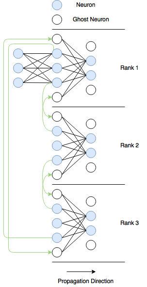
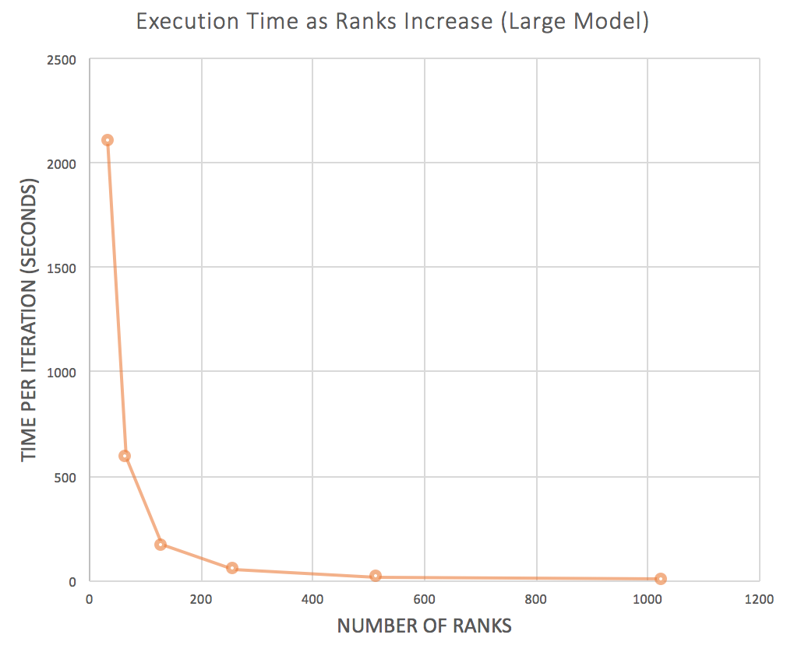

*This paper was written during my undergraduate studies at RPI in 2017. It was my first real attempt at combining ML with high-performance computing, and reflects where I was at the time. Equal parts curiosity and naivety about neural networks. I'd do many things differently now, but building a framework from scratch on a supercomputer was formative.*

*[Download the full paper (PDF)](/papers/massively-parallel-dnn.pdf)*

## Background

Back in 2017, I was really into the idea of training large neural networks but kept running into the same wall. It takes forever. The forward prop, backprop, and weight update steps all scale with the number of weights, and once you get into the millions of parameters, a single machine just isn't going to cut it.

RPI had a Blue Gene/Q supercomputer called [AMOS](https://cci.rpi.edu/aimos), and our High Performance Computing class gave us access to it. So for our final project, I set out to build a neural network framework from scratch, parallelize it with MPI, and see if I could get meaningful speedups on this thing.

## What I Built

I wrote the whole framework in C++. Three classes: Network, Layer, Neuron. You could set up a model in a few lines.

```cpp
Network net = Network();
net.addLayer("input", 3);
net.addLayer("hidden", 256);
net.addLayer("hidden", 512);
net.addLayer("output", 128);
net.initializeNetwork();
```

For parallelism, I went with model parallelism rather than data parallelism. Instead of copying the whole network to every node and splitting the data, I split the neurons in each layer across MPI ranks. Each rank owns a chunk of neurons and is responsible for their forward and backward passes.

The tricky part is communication. In a fully connected network, every neuron in one layer connects to every neuron in the next. If those neurons live on different ranks, they need to talk to each other. Doing that for every connection would be way too expensive. So I made a tradeoff and only communicated values at the boundaries between ranks, using what I called ghost neurons.



Each rank has a ghostTop and ghostBottom neuron that hold values received from neighboring ranks. The actual message passing used `MPI_Isend` and `MPI_Irecv` for the boundary exchanges, `MPI_Allgather` to combine outputs for loss computation, and `MPI_Barrier` to sync everything up.

## The Numbers

I tested three model sizes.

| Model | Input | Hidden Layers | Output | Total Weights |
|-------|-------|---------------|--------|---------------|
| Small | 3 | 64 → 128 → 256 | 64 | 57K |
| Medium | 2048 | 4096 → 4096 → 4096 | 2048 | 50M |
| Large | 2048 | 32768 → 8192 → 4096 | 2048 | 377M |

The small model got a **497x speedup** going from 2 to 33 ranks on a single node. That's pretty wild for a model that size.

The large model is where it gets more interesting. With 33 ranks, one iteration took 2,107 seconds. I scaled up to 32 nodes and 1,025 ranks and got that down to **6.4 seconds**. 327x speedup.



The communication overhead stayed surprisingly low too. Even at 1,025 ranks, only about 7% of the iteration time was spent on message passing. Most of the time was actual computation.

## Reflecting on it after ~10 years

OK so the big thing I never actually showed is whether the parallel version actually *learns*. All of our results are wall-clock speedups. I confirmed that the framework could learn on smaller models with real data, but for the large-scale tests I just generated dummy data because I couldn't find a dataset that fit a model with 377 million weights. Not great.

The other issue is the ghost neuron design. By only exchanging boundary values, the parallel version isn't computing the same thing as the serial version. Each rank only sees a slice of the previous layer, which means the network is learning more localized features than a fully connected one would. I probably should have used `MPI_Bcast` to maintain full connectivity, even if it meant more communication overhead. At least it would have been correct.

And honestly, if I were doing this today, I wouldn't build the framework from scratch. But as an undergrad, building a neural network neuron by neuron and feeling mildly superhuman seeing it run on our supercomputer was the whole point :)